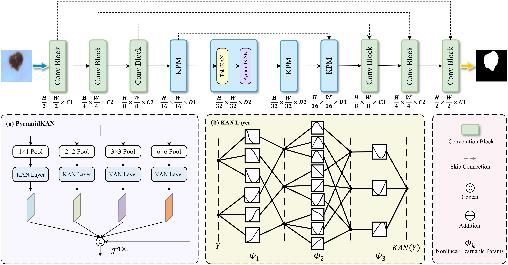
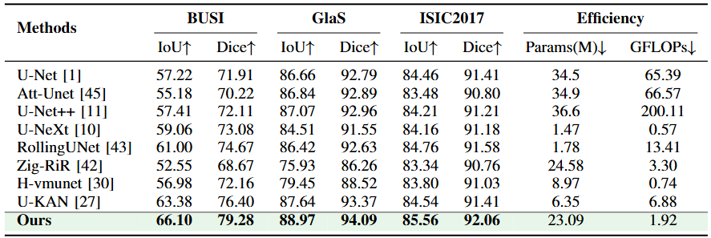

# KCNet

## 0. Abstract

Accurate segmentation of lesions in medical images is crucial for improving clinical diagnosis and robot-assisted treatment. However, medical images often exhibit lesion clustering and significant size variations, posing challenges to segmentation. While existing Kolmogorov-Arnold network (KAN)-based methods have made progress in model efficiency and interpretability, they still struggle with effective multi-scale feature extraction. Furthermore, traditional pixel-level loss functions (such as BCE and Dice) fail to explicitly consider the connectivity of pixel clusters, resulting in poor segmentation of lesions. To address these issues, we propose KCNet: a segmentation network that uses Tok-KAN for nonlinear modeling and deeply fuses the pyramid structure with KAN. This design preserves multi-scale information while reducing redundancy between pyramid levels. Simultaneously, we introduce a cluster-sensitive distance loss function that explicitly models the connectivity and boundary sharpness of pixel clusters, thereby better preserving the integrity of lesion clusters. To comprehensively evaluate the performance of the proposed method, we conducted systematic experiments on three public benchmark datasets: BUSI, GlaS, and ISIC2017. The results consistently demonstrate that KCNet outperforms current models, achieving IoU improvements of 2.72%, 1.33%, and 1.02% respectively. For reproduction, the implementation codes can be checked out at https://github.com/szz213/KCNet.


## 1. Overview

<div align="center">

</div>


## 2. Main Environments

You can follow the [U-KAN](https://github.com/Zhaoyi-Yan/U-KAN) and [UltraLight-VM-UNet](https://github.com/wurenkai/UltraLight-VM-UNet) installation instructions, or follow the steps below (Python 3.8):

```
conda create -n KCNet python=3.8
conda activate KCNet
pip install torch==1.13.0 torchvision==0.14.0 torchaudio==0.13.0 
pip install packaging
pip install timm==0.4.12
pip install pytest chardet yacs termcolor
pip install submitit tensorboardX
pip install triton==2.0.0
pip install causal_conv1d==1.0.0  
pip install mamba_ssm==1.0.1
pip install scikit-learn matplotlib thop h5py SimpleITK scikit-image medpy yacs
pip install addict dataclasses pandas pyyaml albumentations tqdm tensorboardX numpy opencv-python
pip install perceptual pillow scipy tifffile typing-extensions yapf
```


## 3. Datasets

BUSI: The dataset can be found [here](https://www.kaggle.com/datasets/aryashah2k/breast-ultrasound-images-dataset) .

GlaS: The dataset can be found [here](https://websignon.warwick.ac.uk/origin/slogin?shire=https%3A%2F%2Fwarwick.ac.uk%2Fsitebuilder2%2Fshire-read&providerId=urn%3Awarwick.ac.uk%3Asitebuilder2%3Aread%3Aservice&target=https%3A%2F%2Fwarwick.ac.uk%2Ffac%2Fcross_fac%2Ftia%2Fdata%2Fglascontest&status=notloggedin) .

ISIC2017: The dataset can be found [here](https://challenge.isic-archive.com/data/) .


## 4. Train the KCNet

```
python train.py --arch KCNet --dataset {dataset} --input_w {input_size} --input_h {input_size} --name {dataset}_KCNet  --data_dir [YOUR_DATA_DIR]
```


## 5. Test the KCNet 

```
python val.py --name ${dataset}_KCNet --output_dir [YOUR_OUTPUT_DIR] 
```


## 6. Comparison With State of the Arts

The performance of the proposed method is compared with the state-of-the-art models on the BUSI, GlaS, and ISIC2017 datasets, where the best results are shown in bold.

<div align="center">

</div>


## 7. Acknowledgement

Thanks to [U-KAN](https://github.com/Zhaoyi-Yan/U-KAN) and [UltraLight-VM-UNet](https://github.com/wurenkai/UltraLight-VM-UNet) for their outstanding works.
